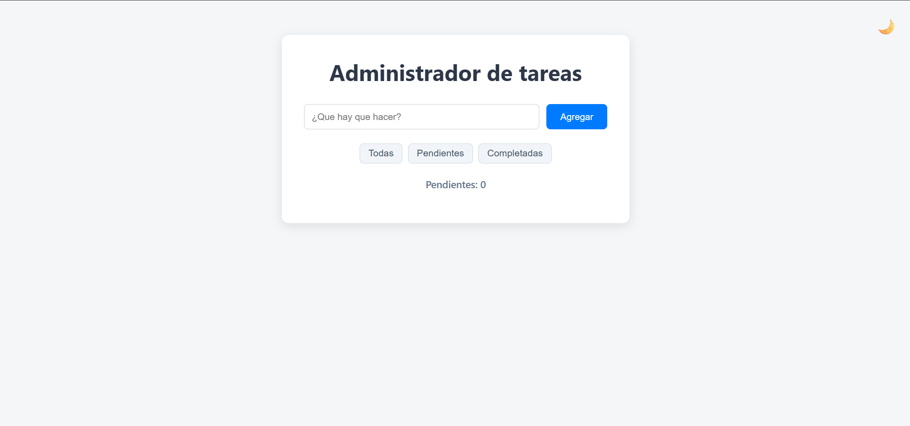
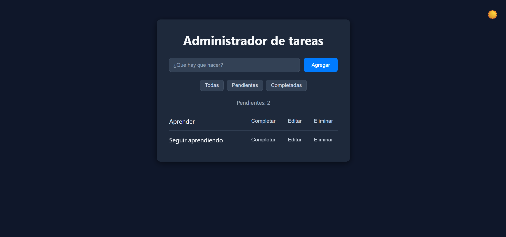

# 📝 Task Manager Web App

Una aplicación web **Full Stack (SPA)** para la gestión interactiva de tareas, construida con una arquitectura desacoplada utilizando **Vanilla JavaScript** en el frontend y **FastAPI** en el backend.

---

## 🔗 Demos en Vivo

* **Frontend (Vercel):** [task-manager-app.vercel.app](https://task-manager-app-mu-gold.vercel.app/)
* **Backend API (Render):** [task-manager-app-m3is.onrender.com/tasks](https://task-manager-app-m3is.onrender.com/tasks)
* **Documentación Interactiva (Swagger/OpenAPI):** [task-manager-app-m3is.onrender.com/docs](https://task-manager-app-m3is.onrender.com/docs)

---

---

## 📸 Vista Previa

<p align="center">
  
  
</p>

---

## 🚀 Características Clave

* **CRUD Completo:** Creación, lectura, actualización de estado (pendiente/completada) y eliminación de tareas en tiempo real.
* **Interfaz Dinámica (SPA):** Construida con JavaScript vanilla, sin librerías pesadas, manipulando directamente el DOM.
* **API RESTful Asíncrona:** Backend desarrollado con FastAPI y validación estricta de datos mediante Pydantic y SQLModel.
* **Persistencia de Datos:** Base de datos SQLite gestionada mediante ORM.
* **Soporte CORS:** Middleware configurado para permitir peticiones seguras entre dominios cruzados.
* **Diseño Responsivo y Modo Oscuro:** Interfaz optimizada con animaciones CSS personalizadas.

---

## 🛠️ Tecnologías Utilizadas

### **Frontend**
* **HTML5 & CSS3** (Keyframes, Flexbox, CSS Grid)
* **JavaScript (ES6+)** (Fetch API, Async/Await, DOM Manipulation)
* **Despliegue:** Vercel

### **Backend**
* **Python 3.10+**
* **FastAPI** & **Uvicorn**
* **SQLModel / SQLite**
* **Despliegue:** Render

---

## 📂 Estructura del Proyecto

```text
task-manager-app/
├── backend/
├── database.py       # Configuración de la base de datos SQLite y sesión
├── main.py           # Endpoints de FastAPI y middleware CORS
├── models.py         # Modelos de datos SQLModel / Pydantic
├── requirements.txt  # Dependencias de Python
└── tasks.db          # Base de datos local
├── frontend/
├── app.js            # Lógica de consumo de API y manipulación del DOM
├── index.html        # Estructura principal
└── style.css         # Estilos visuales y animaciones
└── README.md
```
---

## ⚙️ Instalación y Ejecución Local

### **1. Clonar el repositorio**
```bash
git clone
cd task-manager-app
```

### **2. Configurar el backend**
Entrar a la carpeta backend:
```bash
cd backend
```

### **Crear y activar entorno virtual**
```bash
python -m venv venv
```

## En Windows:
```bash
venv\Scripts\activate
```

## En Linux/Mac:
```bash
source venv/bin/activate
```

### Instalar dependencias
```bash
pip install -r requirements.txt
```

### Ejecutar el servidor Uvicorn
```bash
uvicorn main:app --reload
```

### **3. Configurar el Frontend**
Simplemente abre el archivo frontend/index.html en tu navegador o utiliza la extensión Live Server de VS Code.

## 👤 Autor
Iván Tuamá - [Github](https://github.com/IvanTuama98)| [Linkedin](https://www.linkedin.com/in/ivantuama/)

